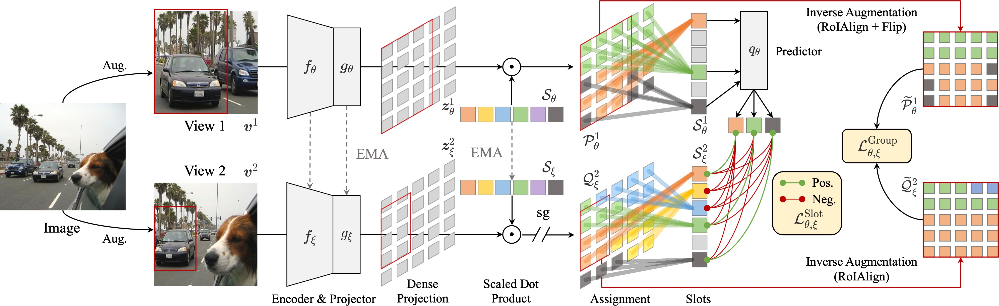
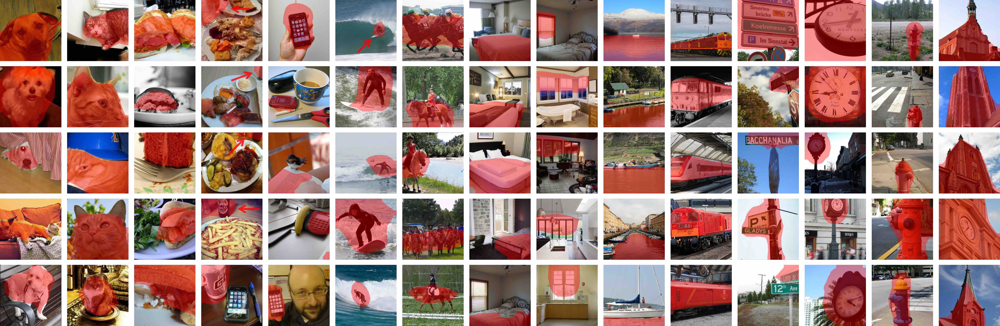

# Self-Supervised Visual Representation Learning with Semantic Grouping

<p align="center">
    <a href="https://proceedings.neurips.cc/paper_files/paper/2022/hash/6818dcc65fdf3cbd4b05770fb957803e-Abstract-Conference.html"></a>
    <a href="https://arxiv.org/abs/2205.15288"></a>
    <a href="https://wen-xin.info/slotcon"></a>
    <a href="https://connecthkuhk-my.sharepoint.com/:f:/g/personal/xwen_connect_hku_hk/Etg2mBDKbFdPgO0W7CX5m94BAVqwX8XLhsLThlMXHIa8hg"></a>
  <a href="https://github.com/CVMI-Lab/SlotCon/blob/master/LICENSE"></a>
</p>
<p align="center">
	Self-Supervised Visual Representation Learning with Semantic Grouping (NeurIPS 2022)<br>
  By
  <a href="https://wen-xin.info">Xin Wen</a>, 
  <a href="https://bzhao.me/">Bingchen Zhao</a>, 
  <a href="https://dblp.org/pid/208/4164.html">Anlin Zheng</a>, 
  <a href="https://scholar.google.com/citations?user=yuB-cfoAAAAJ">Xiangyu Zhang</a>, and 
  <a href="https://xjqi.github.io/">Xiaojuan Qi</a>.
</p>

## Introduction

We propose contrastive learning from data-driven semantic slots, namely SlotCon, for joint semantic grouping and representation learning. The semantic grouping is performed by assigning pixels to a set of learnable prototypes, which can adapt to each sample by attentive pooling over the feature and form new slots. Based on the learned data-dependent slots, a contrastive objective is employed for representation learning, which enhances the discriminability of features, and conversely facilitates grouping semantically coherent pixels together.



Compared with previous efforts, by simultaneously optimizing the two coupled objectives of semantic grouping and contrastive learning, our approach bypasses the disadvantages of hand-crafted priors and is able to learn object/group-level representations from scene-centric images. Experiments show our approach effectively decomposes complex scenes into semantic groups for feature learning and significantly benefits downstream tasks, including object detection, instance segmentation, and semantic segmentation.

## Pretrained models

|  Method |   Dataset   | Epochs | Arch | AP<sup>b</sup> | AP<sup>m</sup> |                                    Download                                           |
|:-------:|:-----------:|:------:|:----:|:--------------:|:--------------:|:-------------------------------------------------------------------------------------:|
| SlotCon |     COCO    |   800  | ResNet-50 |      41.0      |      37.0      | [script](scripts/slotcon_coco_r50_800ep.sh)     \| [backbone only](https://connecthkuhk-my.sharepoint.com/:u:/g/personal/xwen_connect_hku_hk/EblWkXnjvw1Eo9ZsqbnXeKMBnbv3ckUIE8LHYbIMWXKJMw) \| [full ckpt](https://connecthkuhk-my.sharepoint.com/:u:/g/personal/xwen_connect_hku_hk/EZ0wZDBEZ6tEuhHskPZ_Y6gBSTeaBrQd8qLhwjzRmD6MPQ?e=MSgYg7) |
| SlotCon |    COCO+    |   800  | ResNet-50 |      41.8      |      37.8      | [script](scripts/slotcon_cocoplus_r50_800ep.sh) \| [backbone only](https://connecthkuhk-my.sharepoint.com/:u:/g/personal/xwen_connect_hku_hk/EUyUtld5CnRIpbt8Bv_4Ud4BnNj_IyYidwAigf4kxexkxw?e=Y5pRO5) \| [full ckpt](https://connecthkuhk-my.sharepoint.com/:u:/g/personal/xwen_connect_hku_hk/EeXT7OKwVQdBugtryU8rLXYBRfsfOEfJA-JTH8Spn4yVDw?e=majD4e) |
| SlotCon | ImageNet-1K |   100  | ResNet-50 |      41.4      |      37.2      | [script](scripts/slotcon_imagenet_r50_100ep.sh) \| [backbone only](https://connecthkuhk-my.sharepoint.com/:u:/g/personal/xwen_connect_hku_hk/Ebw3pQE_IqNGtWBxrNRLQvABnrNEJdHjoNH1vHjs0EK2wQ?e=611vSK) \| [full ckpt](https://connecthkuhk-my.sharepoint.com/:u:/g/personal/xwen_connect_hku_hk/EUAAU7QehXhIsK7EjlpcRqMBi_uzxe_8tFcUN7AIVdyFEg?e=SJbYjc) |
| SlotCon | ImageNet-1K |   200  | ResNet-50 |      41.8      |      37.8      | [script](scripts/slotcon_imagenet_r50_200ep.sh) \| [backbone only](https://connecthkuhk-my.sharepoint.com/:u:/g/personal/xwen_connect_hku_hk/ESjXwX7gp9VPsfwoEOfkyPoBre3qt92nCyS9VjgkWJVxDA?e=mnTUef) \| [full ckpt](https://connecthkuhk-my.sharepoint.com/:u:/g/personal/xwen_connect_hku_hk/EZ9bTfGqscZBrRCR9ca8gHoBymN4gCdLGPtYOVy6GXqpfw?e=qWtVud) |

Folder containing all the checkpoints: [\[link\]](https://connecthkuhk-my.sharepoint.com/:f:/g/personal/xwen_connect_hku_hk/Etg2mBDKbFdPgO0W7CX5m94BAVqwX8XLhsLThlMXHIa8hg).
## Getting started

### Requirements

This project is developed with `python==3.9` and `pytorch==1.10.0`, please be aware of possible code compatibility issues if you are using another version.

The following is an example of setting up the experimental environment:

* Create the environment
```shell script
conda create -n slotcon python=3.9 -y
conda activate slotcon
```

* Install pytorch & torchvision (you can also pick your favorite version)
```shell script
conda install pytorch==1.10.0 torchvision==0.11.0 cudatoolkit=11.3 -c pytorch
```

* Clone our repo
```shell script
git clone https://github.com/CVMI-Lab/SlotCon && cd ./SlotCon
```

* (Optional) Create a soft link for the datasets
```shell script
mkdir datasets
ln -s ${PATH_TO_COCO} ./datasets/coco
ln -s ${PATH_TO_IMAGENET} ./datasets/imagenet
```

* (Optional) Install other requirements
```shell script
pip install -r requirements.txt
```

### Run pre-training
By default, we train with DDP over 8 GPUs on a single machine. The following are some examples of re-implementing SlotCon pre-training on COCO and ImageNet:

* Train SlotCon on COCO for 800 epochs
```shell script
./scripts/slotcon_coco_r50_800ep.sh
```

* Train SlotCon on COCO+ for 800 epochs
```shell script
./scripts/slotcon_cocoplus_r50_800ep.sh
```

* Train SlotCon on ImageNet-1K for 100 epochs
```shell script
./scripts/slotcon_imagenet_r50_100ep.sh
```

### Evaluation: Object Detection & Instance Segmentation

Please install `detectron2` and prepare the dataset first following the official instructions: [\[installation\]](https://detectron2.readthedocs.io/en/latest/tutorials/install.html) [\[data preparation\]](https://detectron2.readthedocs.io/en/latest/tutorials/builtin_datasets.html)

The following is an example usage of evaluating a pre-trained model on COCO:

* First, link COCO to the required path:
```shell script
mkdir transfer/detection/datasets
ln -s ${PATH_TO_COCO} transfer/detection/datasets/
```

* Then, convert the pre-trained model to detectron2's format:
```shell script
python transfer/detection/convert_pretrain_to_d2.py output/${EXP_NAME}/ckpt_epoch_xxx.pth ${EXP_NAME}.pkl
```

* Finally, train a detector with the converted checkpoint:
```shell script
cd transfer/detection &&
python train_net.py --config-file configs/COCO_R_50_FPN_1x_SlotCon.yaml --num-gpus 8 --resume MODEL.WEIGHTS ../../${EXP_NAME}.pkl OUTPUT_DIR ../../output/COCO_R_50_FPN_1x_${EXP_NAME}
```

### Evaluation: Semantic Segmentation

Please install `mmsegmentation` and prepare the datasets first following the official instructions: [\[installation\]](https://mmsegmentation.readthedocs.io/en/latest/get_started.html#installation) [\[data preparation\]](https://mmsegmentation.readthedocs.io/en/latest/dataset_prepare.html)

* First, link the datasets for evaluation to the required path:
```shell script
mkdir transfer/segmentation/data
ln -s ${PATH_TO_DATA} transfer/segmentation/data/
```

* Then, convert the pre-trained model to mmsegmentation's format:
```shell script
python transfer/segmentation/convert_pretrain_to_mm.py output/${EXP_NAME}/ckpt_epoch_xxx.pth ${EXP_NAME}.pth
```

* Finally, run semantic segmentation in the following datasets: PASCAL VOC, Cityscapes, and ADE20K. 
    * By default, we run PASCAL VOC and Cityscapes with 2 GPUs, and run ADE20K with 4 GPUs, with the total batch size fixed as 16.
```shell script
# run pascal voc
cd transfer/segmentation &&
bash mim_dist_train.sh configs/voc12aug/fcn_d6_r50-d16_513x513_30k_voc12aug_moco.py ../../${EXP_NAME}.pth 2
```

```shell script
# run cityscapes
cd transfer/segmentation &&
bash mim_dist_train.sh configs/cityscapes/fcn_d6_r50-d16_769x769_90k_cityscapes_moco.py ../../${EXP_NAME}.pth 2
```

```shell script
# run ade20k
cd transfer/segmentation &&
bash mim_dist_train.sh configs/ade20k/fcn_r50-d8_512x512_80k_ade20k.py ../../${EXP_NAME}.pth 4
```
### Prototype Visualization

We also provide the code for visualizing the learned prototypes' nearest neighbors.
To run the following command, please prepare a full checkpoint.

```shell script
python viz_slots.py \
    --data_dir ${PATH_TO_COCO} \
    --model_path ${PATH_TO_MODEL} \
    --save_path ${PATH_TO_SAVE} \
    --topk 5 \ # retrieve 5 nearest-neighbors for each prototype
    --sampling 20 # randomly sample 20 prototypes to visualize
```



## Citing this work

If you find this repo useful for your research, please consider citing our paper:

```
@inproceedings{wen2022slotcon,
  title={Self-Supervised Visual Representation Learning with Semantic Grouping},
  author={Wen, Xin and Zhao, Bingchen and Zheng, Anlin and Zhang, Xiangyu and Qi, Xiaojuan},
  booktitle={Advances in Neural Information Processing Systems},
  year={2022}
}
```

## Acknowledgment

Our codebase builds upon several existing publicly available codes. Specifically, we have modified and integrated the following repos into this project:

* https://github.com/zdaxie/PixPro
* https://github.com/facebookresearch/dino
* https://github.com/google-research/google-research/tree/master/slot_attention

## License
This project is licensed under the Apache License 2.0 - see the [LICENSE](LICENSE) file for details.
